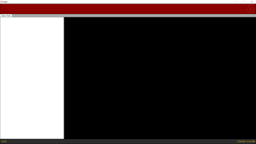
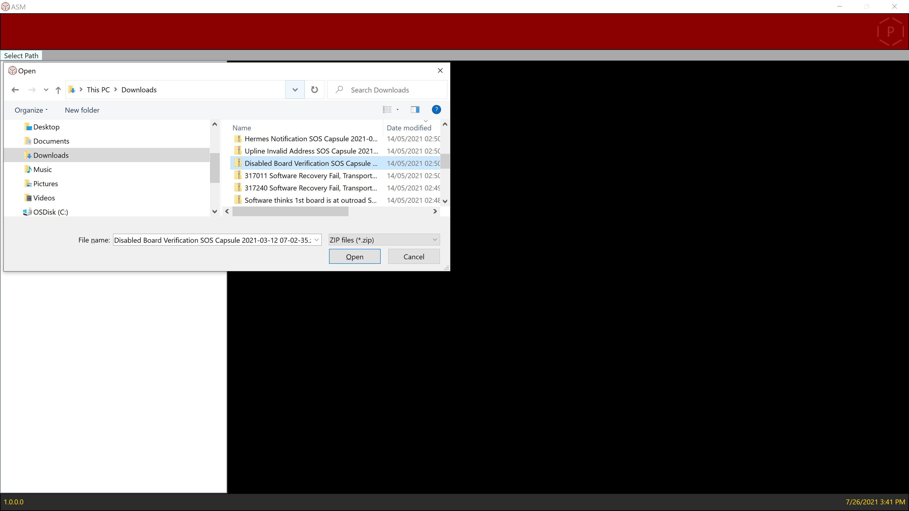
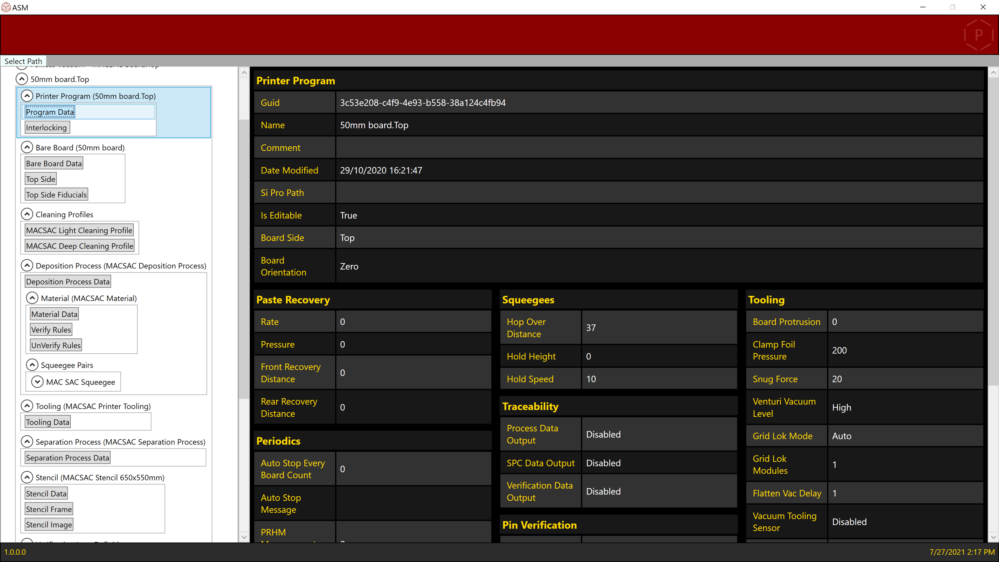

# ASM.DEK.Printer.ProgrammingViewer

Standalone application used internally within ASM Assembly Systems used to read files with information about the current programs runned on the machine before it crashes.
The information is stored within .xml files once read it connects the references and displays the information into an easy-to-understand UI.

Type of software used

Language: C#
Project: WPF
Framework: Prism
IoC Container: Ninject

Design patterns: MVVM, Singleton, Factory, etc.

Advanced features: Reflection, Selection Tree, DataTemplates, etc.

# User Interface

