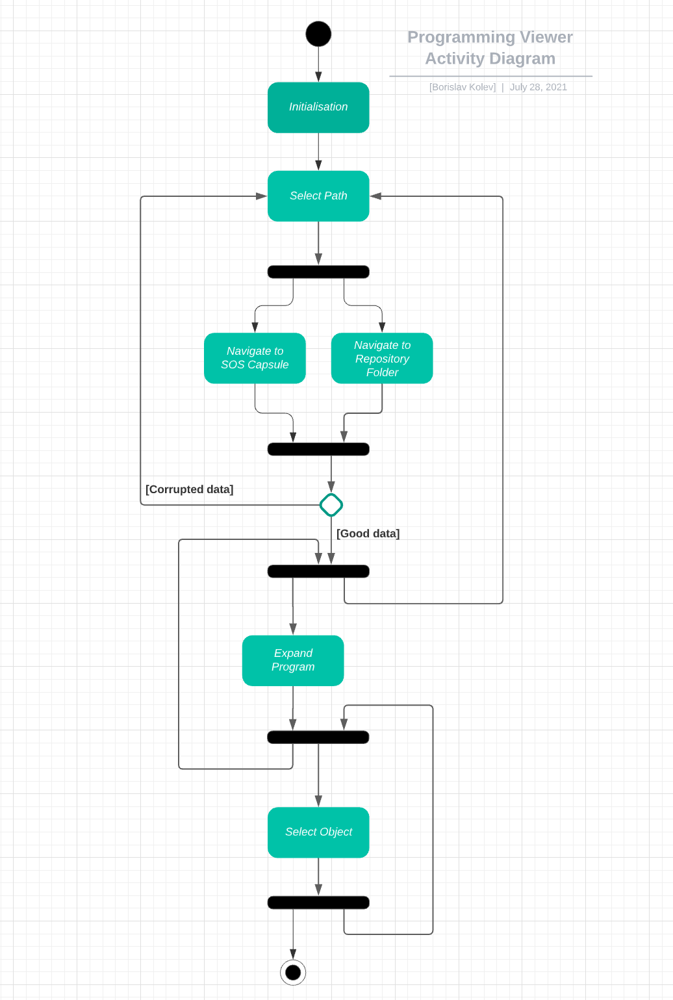
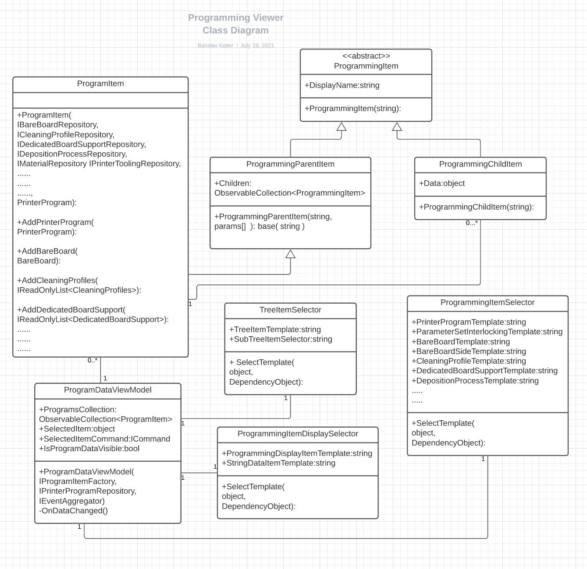
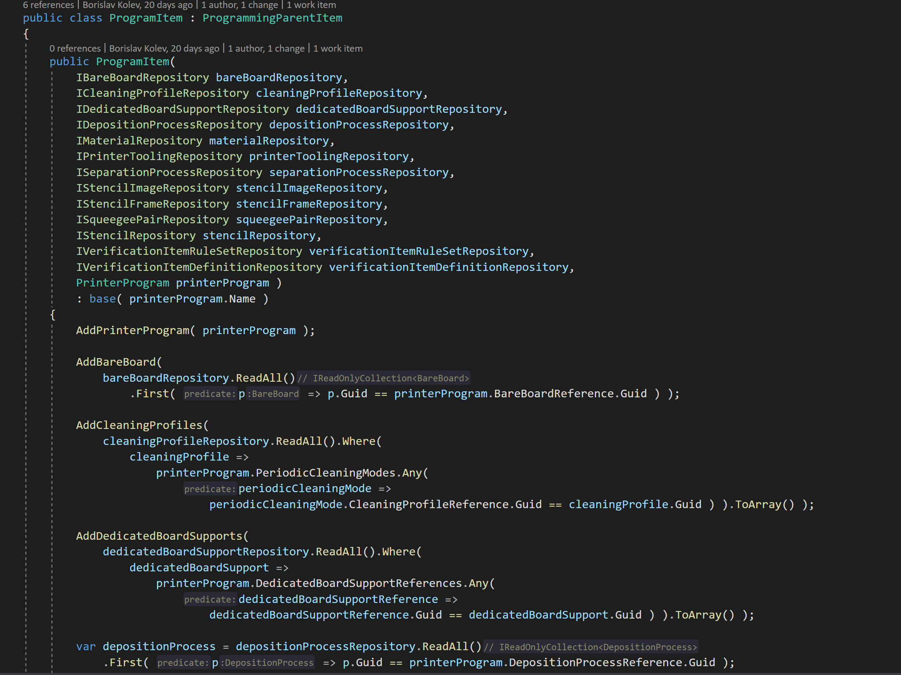
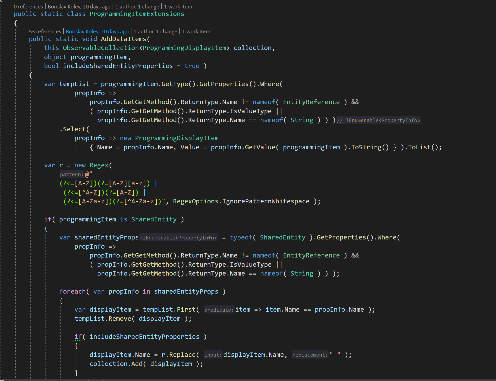
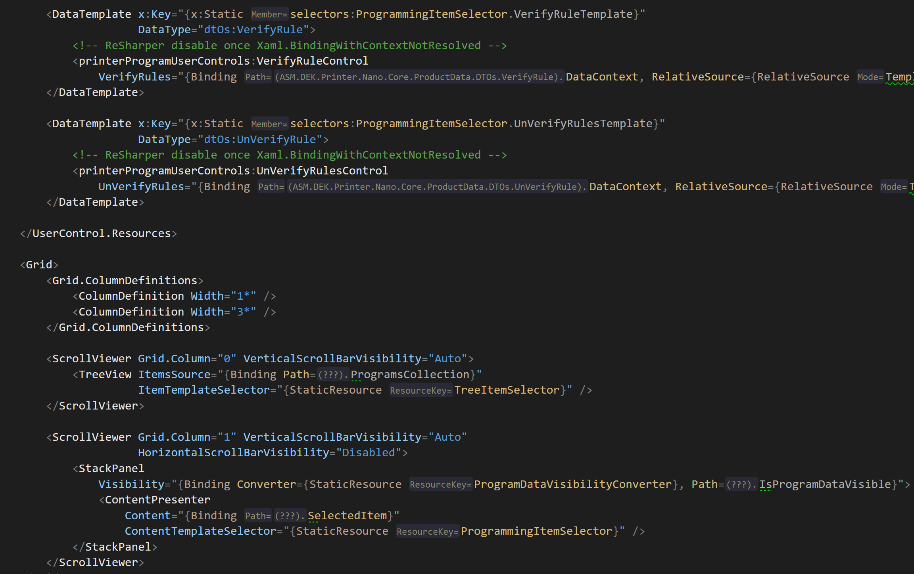
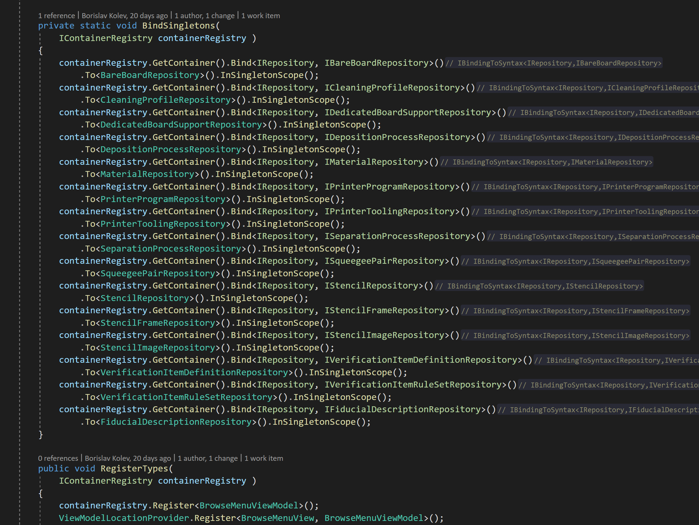

# ASM.DEK.Printer.ProgrammingViewer

Programming Viewer is standalone application used internally within ASM Assembly Systems for reading files with information about the current programs runned on the machine before it crashes. The information is stored within .xml files once read it connects the references and displays the information into an easy-to-understand UI.
You can choose whether to navigate to zipped file, or ProgramRepository folder.

You can see example files of the ones used for debugging at ASM attached to this repository.

Type of software used

Language: C#
Project: WPF
Framework: Prism
IoC Container: Ninject

Design patterns: MVVM, Singleton, Factory, etc.

Advanced features: Reflection, Selection Tree, DataTemplates, etc.

# User Interface

# Initial UI

# Browse to files

# Once files are read

# Search data between different programs

# Activity and class diagram

# Some parts of the code

# Main Program class

# Reflection

# DataTemplates

# Ninject Module

